<!-- 1. Git Configuration Commands -->
<!-- 1.git config --global user.name -->
Command name : git config --global user.name
Syntax : git config --global user.name "user name"
Purpose :Displays all configured git settings.
Example : git config --global user.name "yamunagandalla"
Screenshot proof : 
      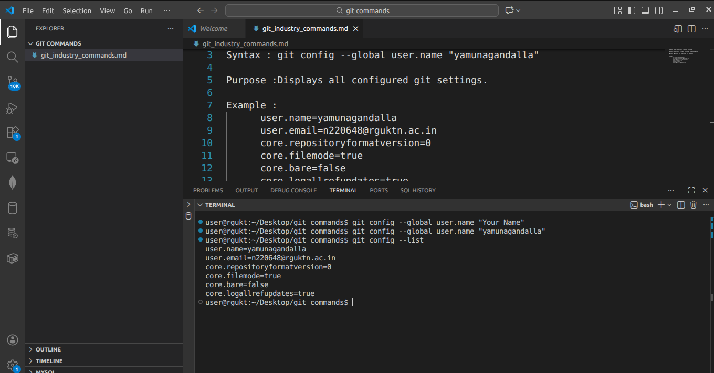

<!-- 2.git config --global user.email -->
Command name : git config --global user.email
Syntax : git config --global user.email "email"
Purpose :it sets our email globally to all repo's this email is attacheched to all commits.
Example : git config --global user.email "n220648@rguktn.ac.in"
Screenshot proof : 
      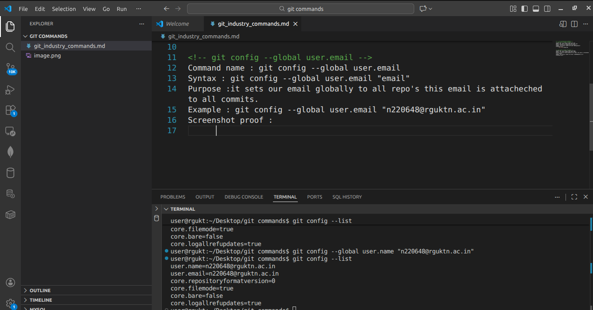

<!-- 3.git config --list -->

Command name : git config --list
Syntax : git config --list
Purpose :Displays all the Git configuration settings that are currently active.
Example :git config --list
Screenshot proof : 
      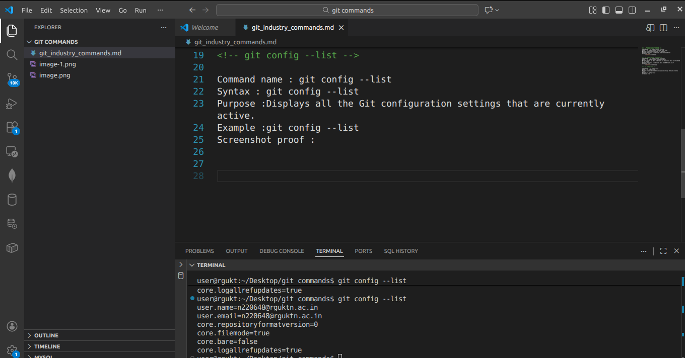

<!-- 4.git config --unset -->
Command name : git config --unset
Syntax :git config --global --unset <key>
Purpose :Removes (deletes) a specific configuration setting from Git.it is used when you want to remove a username, email, or any other configuration helpful when correcting wrong settings.used for cleaning or resetting configuration.
Example :git config --global --unset user.name 
Screenshot proof : 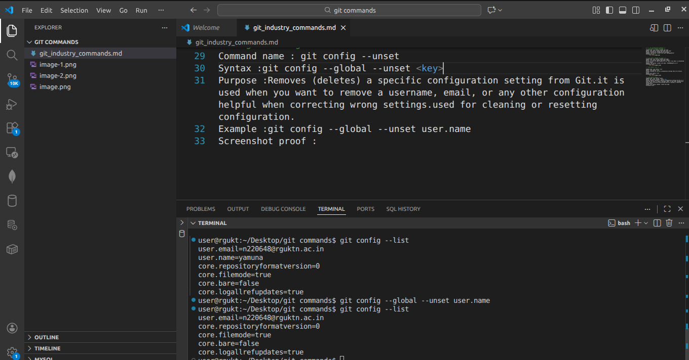

<!-- 2. Repository Setup Commands -->
<!-- 1.git init -->

Command name :git init
Syntax :git init 
Purpose :Initializes (creates) a new Git repository in the current folder.it creates a hidden .git directory.that folder allows Git to start tracking your project.without git init, Git will not track anything.
Example :git init 
Screenshot proof :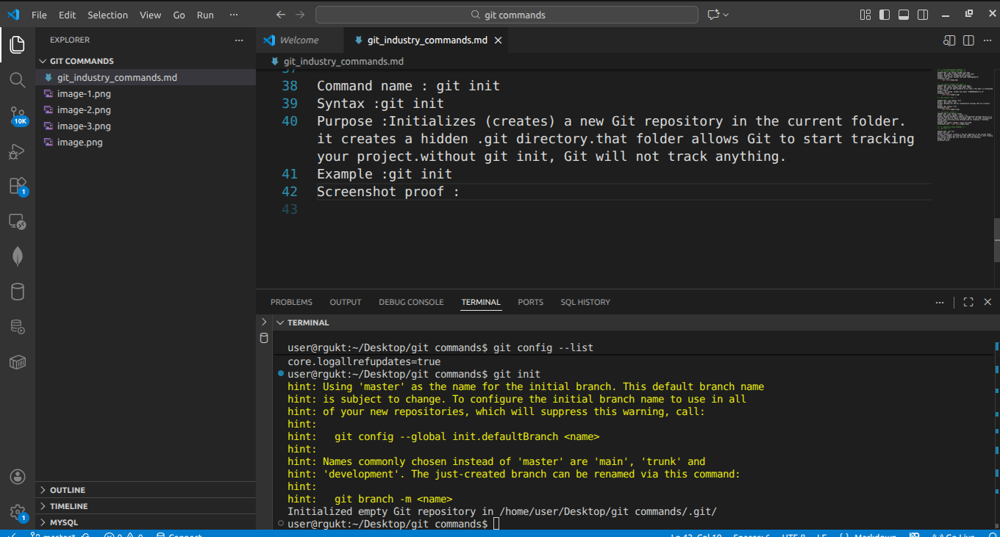

<!-- 2.git clone -->
Command name :git clone
Syntax :git clone <repository-url>
Purpose :Creates a copy of an existing remote repository (usually from GitHub) into your local system.it downloads all files ,it downloads complete commit history,it automatically sets the remote connection (origin)it creates a ready-to-use working directory
Example : git clone https://github.com/yamunagandalla/computer-fundamentals-cybersecurity.git
Screenshot proof :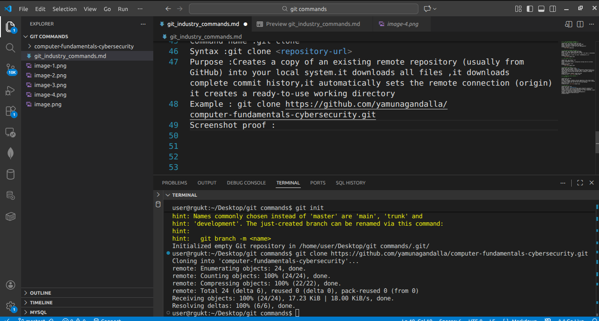

<!-- 3.git clone --branch -->

Command name :git clone --branch
Syntax :git clone --branch <branch-name> <repository-url>
Purpose :Clones a specific branch from a remote repository instead of cloning the default branch.normally, git clone downloads the entire repository and checks out the default branch (usually main).
But --branch allows you to directly clone and switch to a specific branch.
Example :  git clone https://github.com/yamunagandalla/computer-fundamentals-cybersecurity.git test-clone
Screenshot proof :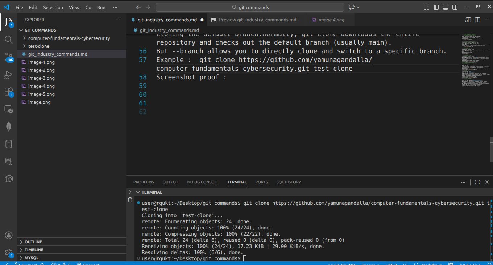

<!--4. git clone --depth -->

Command name :git clone --depth
Syntax :git clone --depth <number> <repository-url> 
Purpose :Creates a shallow clone of a repository.
It downloads only the most recent commits (limited history).
It does NOT download the full commit history.
It makes cloning faster and uses less storage.
Example :git clone --depth 5 https://github.com/yamunagandalla/NETWORKING.git
Screenshot proof : 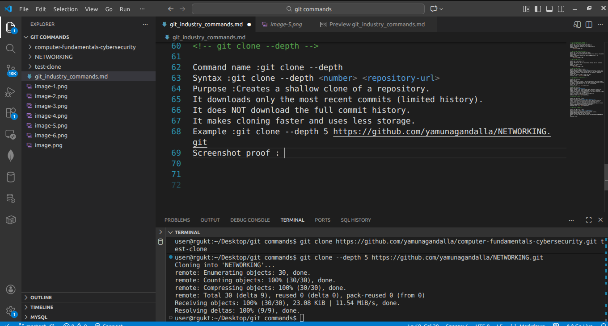

<!-- 3. Repository Status & Inspection -->
<!--1.git status -->

Command name :git status
Syntax : git status
Purpose : to check  the updated files in repo 
Example : git status 
Screenshot proof : 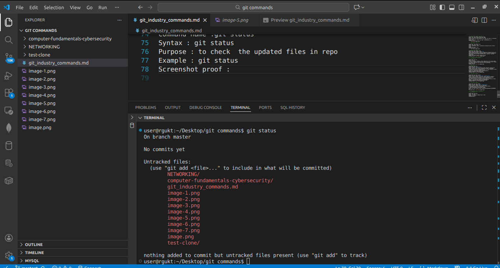

<!-- 2.git log -->

Command name :git log 
Syntax : git log 
Purpose :shows the complete commit history 
Example : git log 
Screenshot proof : 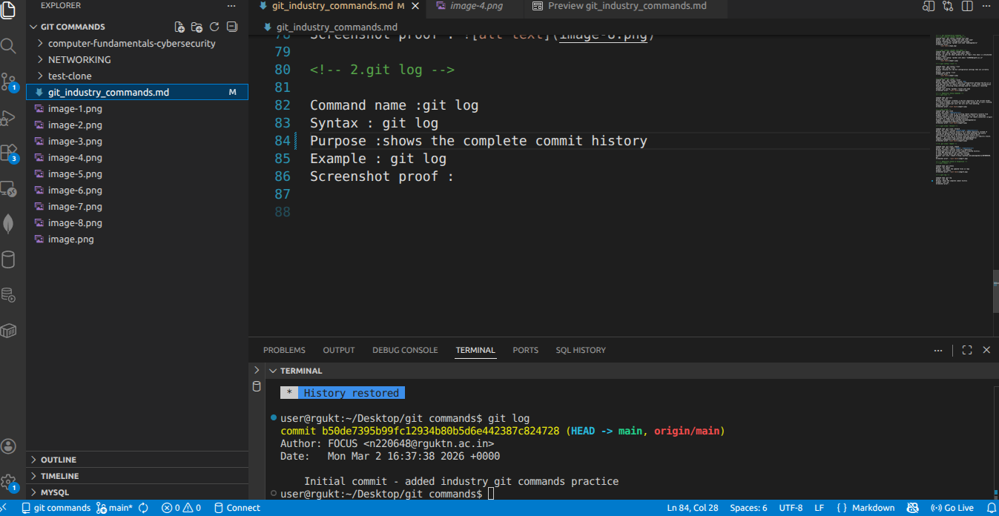

<!-- 3.git log --oneline -->
Command name :git log --oneline
Syntax : git log --oneline
Purpose :Shows the commit history in a short, single-line format.
Example : git log --oneline
Screenshot proof : 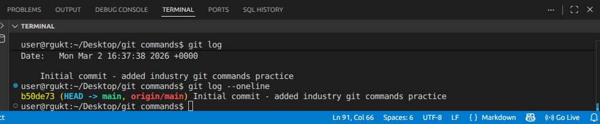

 <!-- 4.git log --graph -->
Command name :git log --graph
Syntax : git log --graph
Purpose :Shows the commit history with a graphical (branch structure) representation in the terminal
Example : git log --graph
Screenshot proof : 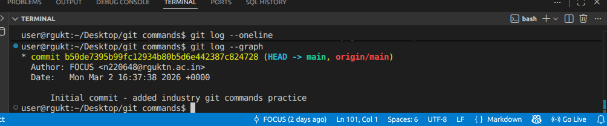

<!-- 5.git show -->

Command name :git show
Syntax : git show
Purpose :Shows detailed information about a specific commit.
Example : git show
Screenshot proof : 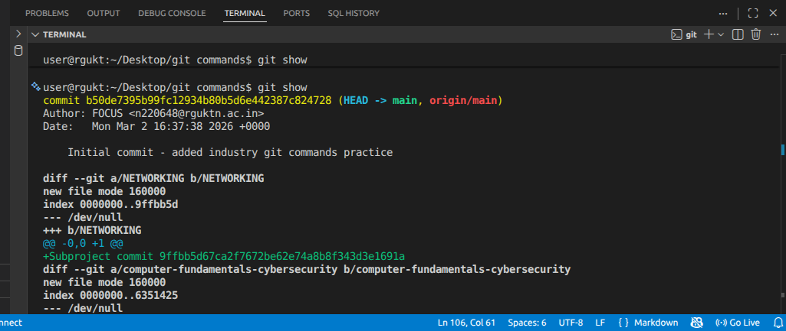

<!-- 6.git diff -->
Command name :git diff
Syntax : git diff
Purpose :Shows the differences between , Modified files and last committed version Or between two commits
Example : git diff
Screenshot: 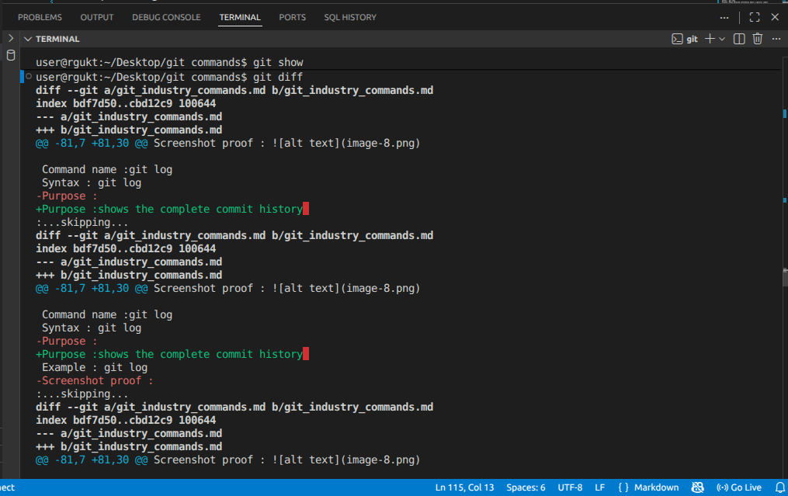

<!-- 7.git diff --staged -->
Command name :git diff --staged
Syntax : git diff --staged
Purpose :Shows the difference between staged changes and the last commit.
Example : git diff --staged
Screenshot: 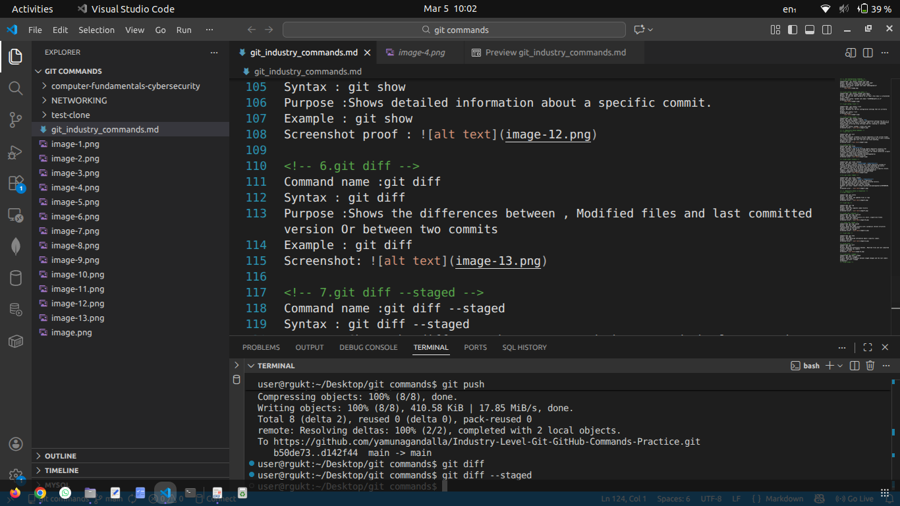
<!-- 8.git blame -->
Command name :git blame
Syntax : git blame <file-name>
Purpose :Shows who modified each line in a file and in which commit.
Example : git blame git_industry_commands.md 
Screenshot: 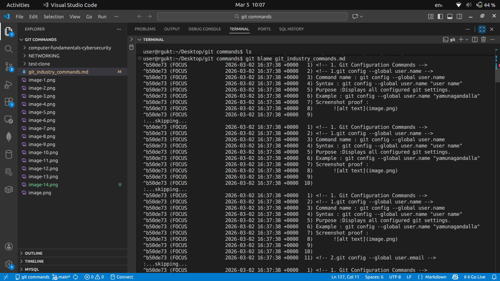

<!-- 9.git reflog -->
Command name :git reflog
Syntax : git reflog
Purpose :Shows the history of all HEAD movements (commits, checkouts, resets, etc.).
Example : git reflog
Screenshot: 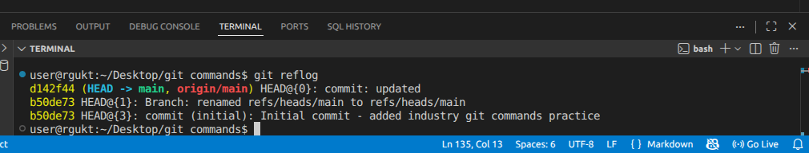
<!-- 10.git shortlog -->
Command name :git shortlog
Syntax : git shortlog
Purpose :Shows a summary of commits grouped by author.
Example : git shortlog
Screenshot: 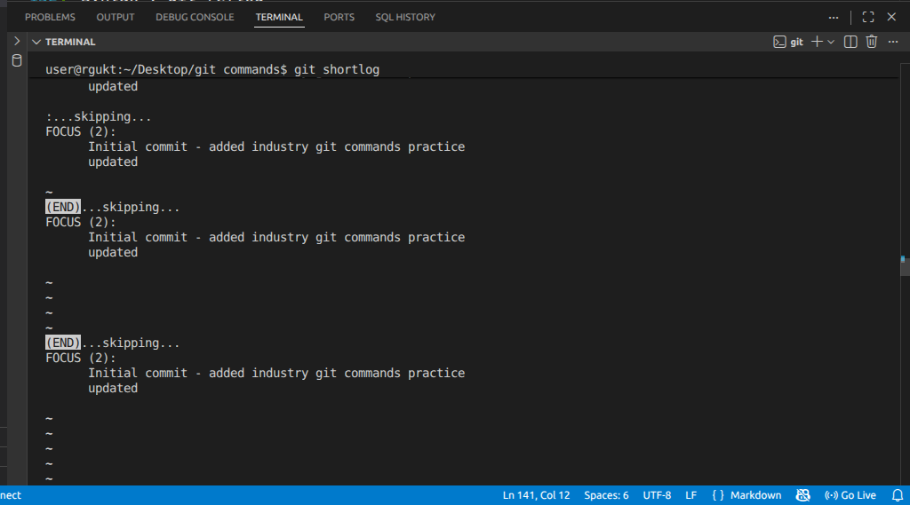

<!-- 4. File Tracking Commands -->
<!-- 1.git add -->
Command name :git add
Syntax : git add <file-name>
Purpose :Adds a specific file to the staging area.
Example : git add example.txt
Screenshot: 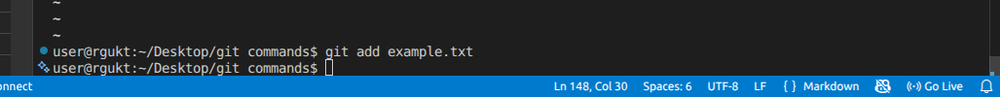

<!-- 2.git add . -->
Command name :git add .
Syntax : git add .
Purpose :Adds all modified and new files in the current directory to the staging area.
Example : git add .
Screenshot: 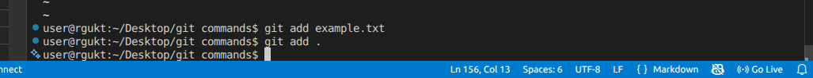

<!-- 3.git add -p -->
Command name :git add -p
Syntax : git add -p
Purpose :Allows staging changes piece by piece (patch by patch) interactively.
Example : git add -p
Screenshot: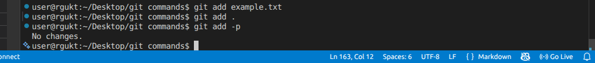
<!-- 4.git restore -->
Command name :git restore
Syntax : git restore
Purpose :Restores a file in the working directory to its last committed state.
Example : git restore git_industry_commands.md
Screenshot: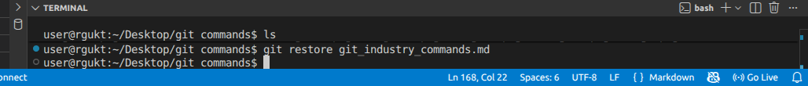
<!-- 5.git restore --staged -->
Command name :git restore --staged
Syntax : git restore --staged <file-name>
Purpose :Removes a file from the staging area but keeps the changes in the working directory.
Example : git restore git_industry_commands.md
Screenshot: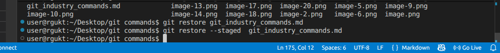
<!-- 6.git rm -->
Command name :git rm
Syntax : git rm <file-name>
Purpose :Removes a file from the working directory and staging area.
Example :git rm example.txt
Screenshot: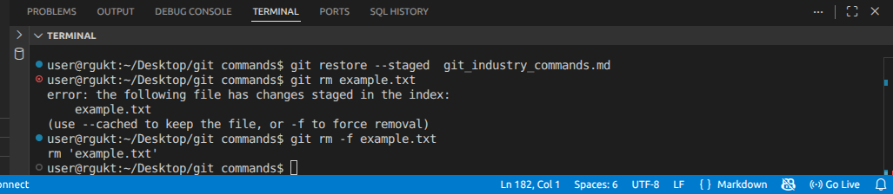
<!-- 7.git mv -->
Command name :git mv
Syntax : git rm <old-file-name> <new-file-name>
Purpose :Moves or renames a file in the repository.
Screenshot:

